# The lead magnet system: what we actually have

**17 Aug 2026.** Plain-text version of the system map, readable on phone and in GitHub.

Production works end to end. Capture does not, because the auto-DM points at a landing page that was specified in detail and never built.

---

## The pipeline

```mermaid
flowchart LR
  A[Source material<br/>transcript + visuals] -->|feeds| B[Skill<br/>_master + 1 subtype]
  B -->|builds| C[Notion asset<br/>5-7 nested subpages]
  C -->|crops| D[Cover image<br/>screenshot of page 1]
  D -->|attaches| E[Post<br/>X / LinkedIn]
  E -->|reader comments keyword| F[Auto-DM<br/>LeadShark]
  F -.->|links to| G[Landing page<br/>Kit, email gate]
  G -.->|delivers| H[Welcome email<br/>delivers the asset]
  H -.->|feeds| I[Measurement<br/>comments, DMs, calls]

  classDef live fill:#E4F0EA,stroke:#1C7355,color:#13301F
  classDef gone fill:#FAE7E9,stroke:#9E2C38,color:#5A151D,stroke-dasharray: 5 4
  class A,B,C,D,E,F live
  class G,H,I gone
```

Solid boxes run today. Dashed boxes do not exist.

**The chain breaks between Auto-DM and Landing page.** The DM template already contains a `LINK` field. It has nowhere to point. Nothing downstream has been built, so no magnet has ever been measured.

---

## The skill files

Seven files, 1,652 lines. One shared shell, five subtypes, one delivery builder.

| File | What it holds | State |
|---|---|---|
| `lead-magnet/_master.md` | Title formula, the $100 bar, post + DM templates, LeadShark config, cover spec, LP spec | Blocked |
| `prompt-swipe-file.md` | Prompt packs. Named as the default first subtype to ship | Ready |
| `framework.md` | A repeatable method, 5 components, before/after panel | Ready |
| `youtube-video.md` | A video disguised as a written breakdown. Assumes it's Mauro's video | Ready |
| `case-study.md` | One transformation. Needs real source material and a wins log | Unusable |
| `industry-specific.md` | A niche kit. Its own Active Niches table is empty and says do not draft | Unusable |
| `notion-delivery-build.md` | The Chrome-extension prompt forcing nested subpages. Hardcoded to exactly 5 | Blocked |

---

## Blocked by a placeholder

Each of these stops a magnet shipping. Each is a five-minute decision.

| Placeholder | Where it bites | Needed |
|---|---|---|
| `{{calendly_url}}` | Every Notion CTA, every DM P.S., the final subpage | A booking link, or "reply to this" instead |
| `#4A392C` | Every Notion page cover, the fallback designed card | One hex, reused on every magnet |
| Authority anchors | Every LinkedIn post, every asset's top line | Sign-off on which numbers are public |
| Kit + `get.ghostedcalls.com` | The whole capture half of the diagram | An email platform, or accept DM-only capture |

---

## Missing entirely

- **No production SOP.** `_master.md` line 44 says so itself.
- **No written image prompts.** Both prompt-block formats are defined and every instance ends in `...`. Not one complete copy-paste prompt exists, and the Notion build prompt never emits them.
- **No measurement file.** The system says track comment rate, DMs received, qualified calls. Nothing captures any of the three.
- **No `brand/wins-log.md` or `brand/social-proof/`.** Two subtypes depend on them.
- **No subtype for a third-party video.** The Brando run used someone else's video; `youtube-video.md` assumes it's Mauro's.

---

## Sitting outside the system

**The JK Molina insight model. NOT ADOPTED.**

16 PDFs, 225 pages, synthesised to `research/jk-molina/synthesis.md`. A candidate second magnet model was drafted and briefly shipped into `skills/`, then moved back out to `research/jk-molina/candidate-insight-model.md`.

It carries an adopt / adapt / reject table with a reason per row: 6 adopt, 4 adapt, 5 reject. JK sells coaching to coaches on a weekly fee. That is a different business from installing a content engine for a $300k/mo agency. The ladder and the naming discipline transfer. The pricing and the cadence do not.

**Also outside, and more important:** `research/jk-molina/cashie-studio/` is where Mauro's own completed offer and offer validation go. Once that lands, the "no offer" claim across `operating-baseline.md`, `business-context-answers.md`, `vision-2026.md` and `ACTIONS.md` needs reconciling.
